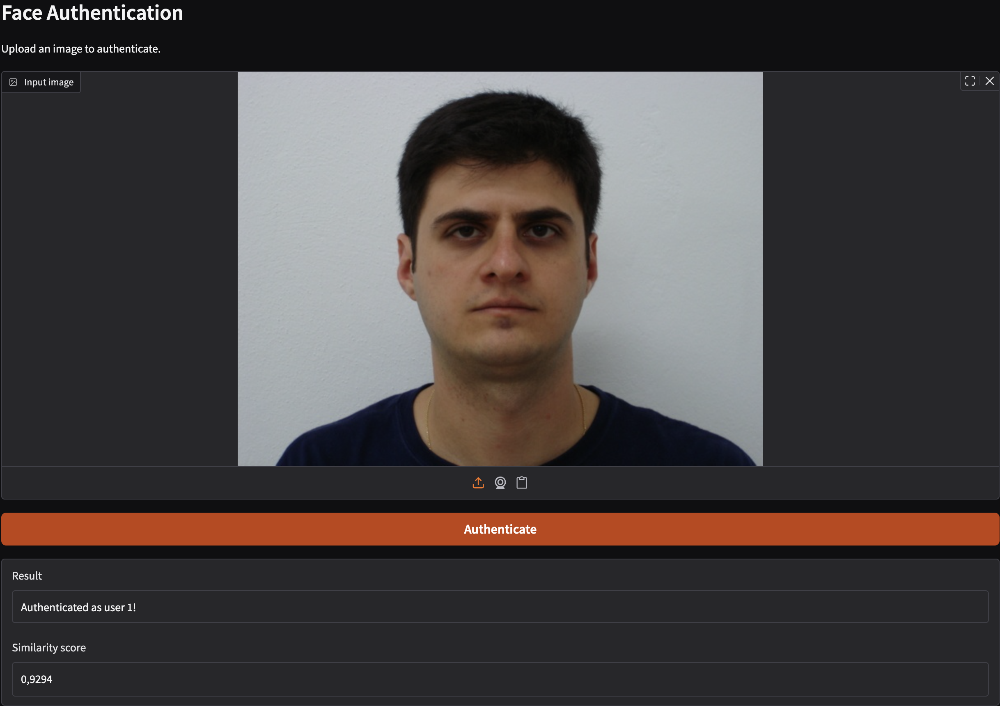
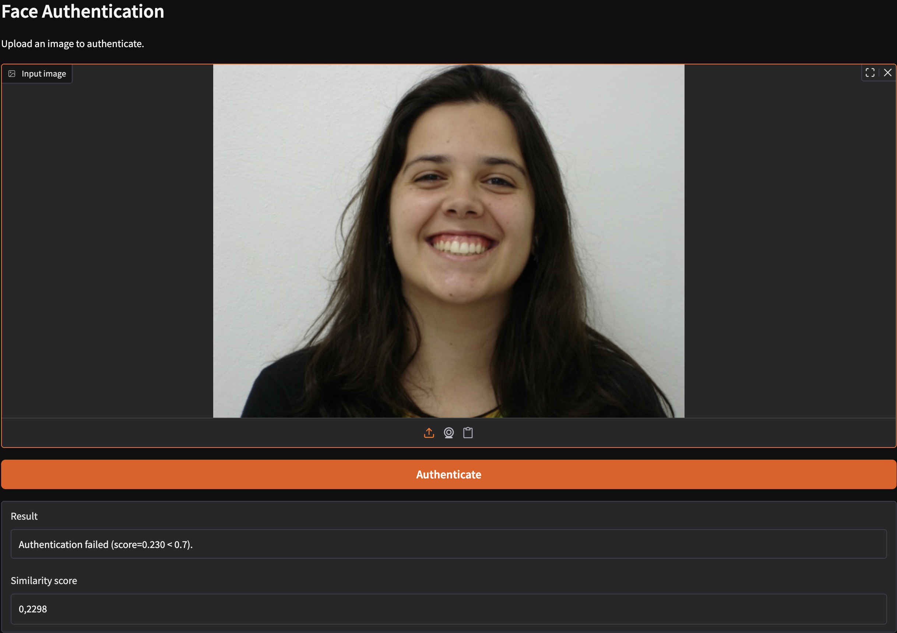
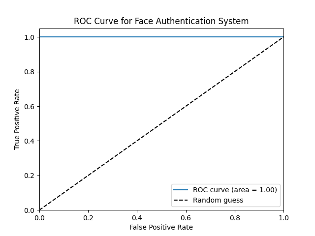

# Face Authentication App

## Overview

This repository contains a small face authentication system used for a biometrics course.
The system builds face embeddings from images, stores them in a small database, and
provides a Gradio-based UI for authenticating a user by comparing an uploaded image
against stored embeddings using cosine similarity.

## Repository layout (important files)

- `project/`
  - `app.py` - Gradio UI and authentication entry point.
  - `build_storage.py` - Script that builds the embeddings database (storage file).
  - `config.py` - Configuration values (paths, thresholds, model options).
  - `embedding_model.py` - Model wrapper that converts image -> embedding.
  - `prepare_data.py` - Helpers for preparing / organizing dataset for building storage.
  - `evaluate_auth.py` - Utilities to evaluate authentication performance (ROC, metrics).
  - `utils.py` - Small helper functions (loading/saving storage, similarity computation).
  - `requirements.txt` - Python dependencies required to run the project.
  - `storage.pkl` - Example pre-built storage (may be large; keep under `project/` or in `data/`).

## Quickstart

1. Create a virtual environment and install dependencies

```bash
python -m venv .venv
source .venv/bin/activate
python -m pip install --upgrade pip
python -m pip install -r project/requirements.txt
```

2. Prepare the dataset (if you wish to build the storage yourself)
- Download the dataset [here](https://fei.edu.br/~cet/facedatabase.html).
- Organize the dataset as presented below:
```
  data/
    ├── users/
    │   ├── <photo_1>.jpg
    │   ├── <photo_2>.jpg
    │   └── ...
    ├── impostors/
    │   ├── <photo_1>.jpg
    │   ├── <photo_2>.jpg
    │   └── ...

```
- Run the `prepare_data.py` script to copy the relevant images into the `project/` folder for building storage:

- The impostors directory contains images of people who are not enrolled users, used to evaluate false acceptance rates. The users directory contains images of enrolled users, used to build the storage and evaluate true acceptance rates.

3. Prepare or build the embeddings database

- If you already have a `storage.pkl` (pre-built) in `project/` or the path configured in `project/config.py`, you can skip building.
- Otherwise build it by running the storage builder script. The script name in this repo is `build_storage.py`:

```bash
python project/build_storage.py
```

Replace or inspect `project/config.py` if you want to change where the storage is saved or which dataset is used.

3. Run the Gradio UI

```bash
python project/app.py
```

Open the local Gradio link printed in the terminal and upload a face image to authenticate.

- Example successful authentication screenshot:

- Example failed authentication screenshot:


## How authentication works (high level)

1. The UI (`app.py`) accepts an uploaded image.
2. The `EmbeddingModel` (wrapped in `embedding_model.py`) converts the image to a numeric embedding vector.
3. The database storage (a pickled file containing a mapping and an embeddings matrix) is loaded with `utils.load_database`.
4. Cosine similarity between the input embedding and all stored embeddings is computed.
5. The highest similarity score is compared with `config.THRESHOLD` to accept or reject.

## Configuring thresholds and storage

Open `project/config.py` to change default values. Typical configurable items:

- STORAGE_PATH — path to the saved storage (pickle) file containing embeddings and metadata.
- THRESHOLD — similarity threshold used to decide authentication success.
- MODEL_NAME / MODEL_OPTIONS — which embedding model or pre-processing parameters to use.

## Storage file format

The storage pickle created by `build_storage.py` contains at least two artifacts:

- `row_to_user_map` — a sequence (list) mapping each row index in the embeddings matrix to a user identifier.
- `embeddings` — a 2D numpy array (N x D) where N is number of stored samples and D is embedding dimension.

These are loaded by `utils.load_database` and used by `app.py`.

## Evaluating performance

The repository includes `evaluate_auth.py` that can compute ROC curves, FAR/FRR, and other standard biometric metrics.
A pre-generated ROC image exists in the static folder (`./static/roc_curve.png`).


